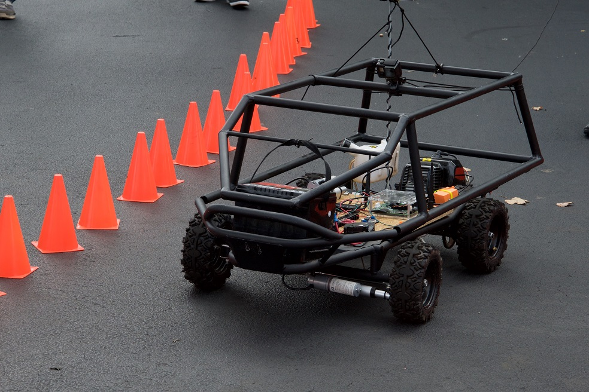
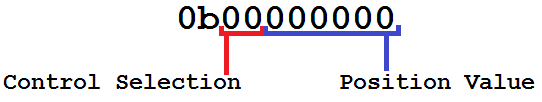

# The Cockroach
The "Cockroach" is the colloquial name for our first vehicle. It was built over the summer of 2015 by AutoAI. Below is a breakdown of the various aspects of its design.

#Hardware
- The Cockroach began as a [ScooterX Baja 49cc Go-Kart](http://www.scooterx.biz/en/gas-go-karts/20-49cc-scooterx-baja-off-road-go-kart.html).
- The frame has been heavily modified. We removed the seat and bolted a sheet of particle board to the frame in its place to house all of the electronics. A custom metal body was bolted to the existing frame to give a more car-like appearance and protect the internals.
- A custom [3D-printed gas cable actuator housing](https://github.com/AutoAI/cockroach-actuator/tree/master/parts) was designed, and uses a standard size servo motor to control acceleration.
- Steering and braking were actuated using [Firgelli Automations linear actuators](https://www.firgelliauto.com/products/feedback-rod-actuator) bolted directly to the steering column and brake cable, respectively.

#Electronics
- A 12v lead acid car battery was strapped to the front of the frame to power the systems.
- The battery was connected to a combination voltage and current meter to monitor power draw and battery life.
- The electrical harness was turned on and off by a 20 amp circuit breaker, which also served as a safety device.
- The main power cables supplying the terminal blocks were 8 gauge stranded copper lines.
- Power distribustion and grounding was handled using screw-type terminal blocks.
- The visual processor and decision-making computer was an [Nvidia Jetson Tk1](http://www.nvidia.com/object/jetson-tk1-embedded-dev-kit.html).
- All visual data was collected from a [StereoLabs Zed Camera](https://www.stereolabs.com/zed/specs/) and sent to the Jetson over USB 3.0 in real time.
- Actuation was controlled by an [Arduino Mega 2560](https://www.arduino.cc/en/Main/ArduinoBoardMega2560) which communicated with the Jetson via serial over USB 2.0.
- The actuators themselves were each powered by an [Arduino PWM Motor Shield] (http://www.robotshop.com/en/10a-dc-motor-driver-arduino-shield.html) attached to the terminal blocks.
- A wireless router is bolted to the underside of the system to allow easy wireless access to be able to ssh into the system from far away.
- 12v to 5v conversion for the arduino and sensors was done by a [DC to DC converter](http://www.ebay.com/itm/LM2596-Buck-Step-down-Power-Converter-Module-DC-4-0-40-to-1-3-37V-LED-Voltmeter-/400802470941?hash=item5d51b05c1d:g:XyoAAOSwLa9UXJBL).

Note that the actuator for the brake applied tension to the brake cable itself, not the brake pad.
#Software
- The Jetson is running the custom ARM build of Ubuntu 14.04 LTS that Nvidia shipped it with.
- Our perception package uses the ZED SDK and is written primarily in (C++).
- The Arduino actuation controller is written in their proprietary language and is compiled down into AVR.
- The software uses the serial interface built into Linux to send commands to the Arduino.

## Actuation
Actuation of the Cockroach is controlled by an arduino project that interfaces with the rest of the AutoAI-Platform and operates according to the commands passed to it via serial. 

###Synchronization
The control section operates asynchronously from the rest of the computer, and has a variable refresh rate. By default, the controller updates at 100Hz. Serial can be sent to the controller at any time, and is collected and applied during the next cycle. At the default refresh rate, this results in at most approximately 10-12ms of latency. This is acceptably fast for driving at low speeds, and can be made much faster as needed.

###Encoding and Transmission
Each time the controller is sent a command, it is in the form of one byte of data. We have written an encoder for said data that provides a balance between raw speed and movement precision. Each packet looks like this:

The first two bits of data indicate which control element is being set. This configuration allows for up to 4 individual controls, which we have assigned as follows:

  * 0b**00** - Stop the engine immediately.
  * 0b**01** - Control steering.
  * 0b**10** - Control acceleration.
  * 0b**11** - Control braking.
  
The last 6 bits of data represent the position value being written to that control. This translates to an unsigned integer from 0-63. We believe that 64 positions per control is adequate for our current vehicle. It is our intention in the future to increase the precision of these controls for use in larger vehicles. Therefore, the currently established ranges for the controls in hexadecimal are as follows:

  * 0x**00** to 0x**3F** - Stop the engine immediately.
  * 0x**40** to 0x**7F** - Control steering, with 0x**40** being extreme left, and 0x**7F** being extreme right.
  * 0x**80** to 0x**BF** - Control acceleration, with 0x**80** being full throttle, and 0x**BF** being zero throttle.
  * 0x**c0** to 0x**FF** - Control steering, with 0x**C0** being no braking, and 0x**FF** being full power braking.
